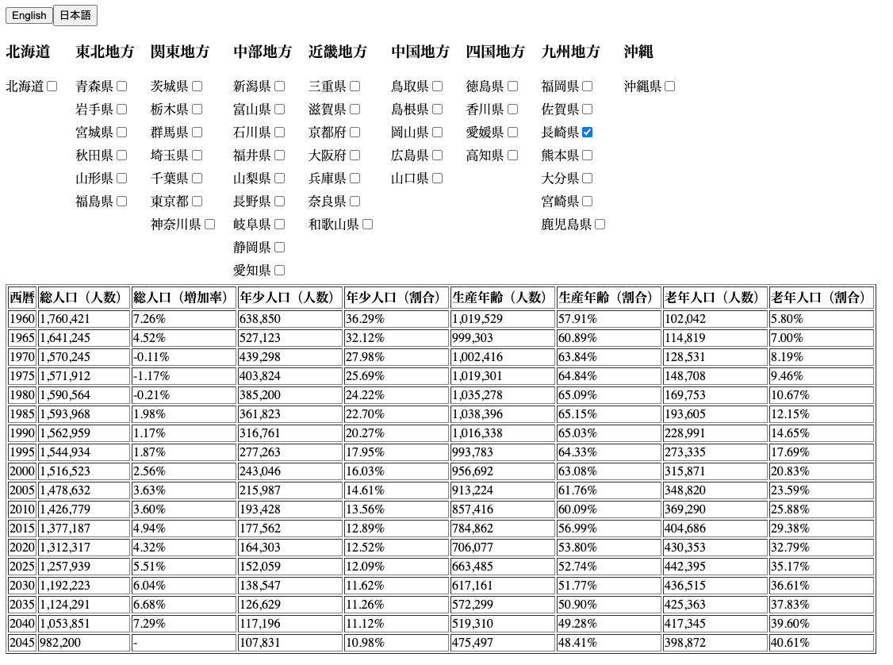

# Web アプリ：都道府県別の総人口推移表を表示する SPA

[Translate in English](./README_EN.md)



この Web アプリは、RESAS-API（地域経済分析システム）から取得した都道府県別の総人口推移データを、表として視覚的に表示するシングルページアプリケーション（SPA）です。チェックボックスをクリックすると、その都道府県の人口推移を見ることができます。  
(※会社の採用試験課題で制作したWebアプリです。)

## 制作環境

- React のバージョン：React 18
- CSS：CSS Modules を使用してスタイルを適用
- OS：Windows 10
- エディタ：Visual Studio Code
- ブラウザ：Google Chrome（バージョン: 103.0.5060.66（Official Build） （64 ビット））
- API：[RESAS-API - 地域経済分析システム](https://opendata.resas-portal.go.jp/)

## 操作方法

アプリケーション内にあるチェックボックスにて都道府県を選択します。選択した都道府県に対応する総人口推移データが表に表示されます。

## 特徴

- 都道府県ごとにチェックボックスを用いた直感的な操作性
- RESAS-API から取得した最新の総人口データを表で表示
- English/日本語ボタンで言語切替

## インストール方法

1. GitHub からプロジェクトをクローンします。
2. プロジェクトディレクトリに移動します。
3. 必要な依存関係をインストールします。

```bash
npm install
```

4. ローカルサーバーを起動し、アプリケーションを開始します。

```bash
npm start
```
