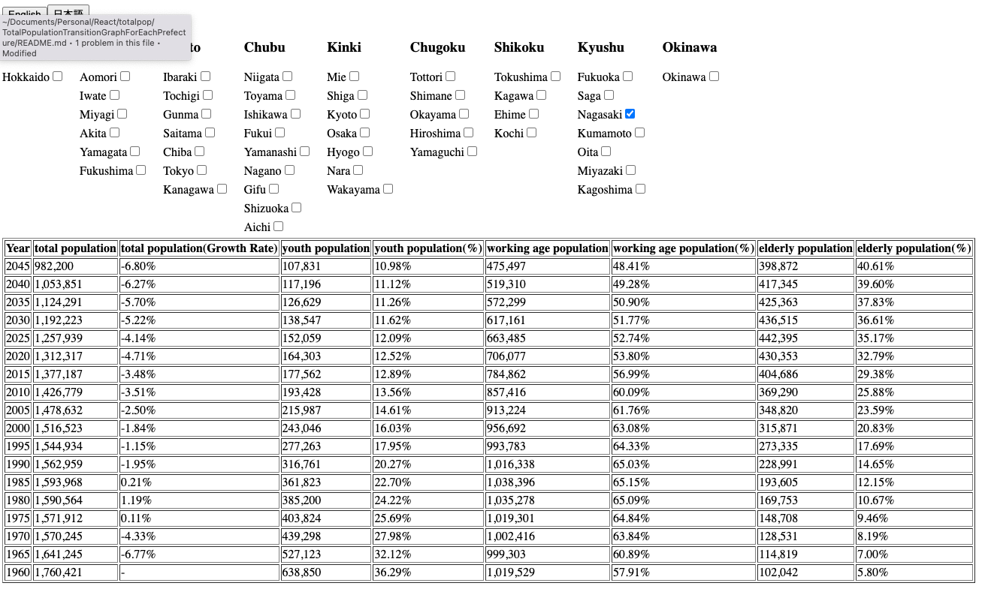

# Web App: SPA Displaying Population Trends by Prefecture in Japan

[Translate in Japanese](./README.md)



This web app is a Single Page Application (SPA) that visually displays population trend data by prefecture in Japan, obtained from the RESAS-API (Regional Economy Analysis System). When you click on the checkbox, you will see the population trends for that prefecture.

## Development Environment

- React Version: React 18
- CSS: Applied styles using CSS Modules
- OS: Windows 10
- Editor: Visual Studio Code
- Browser: Google Chrome (Version: 103.0.5060.66 (Official Build) (64-bit))
- API: [RESAS-API - Regional Economy Analysis System](https://opendata.resas-portal.go.jp/)

## How to Use

Click on a checkbox within the application. The total population trend data corresponding to the selected prefecture will be displayed in a table.

## Features

- Intuitive operation using checkboxes for each prefecture
- Display of the latest total population data obtained from RESAS-API in a table
- Language switch button for English/Japanese

## How to Instll

1. Clone the project from GitHub.
2. Navigate to the project directory.
3. Install the necessary dependencies.

```bash
npm install
```

4. Start the local server and start the application.

```bash
npm start
```
